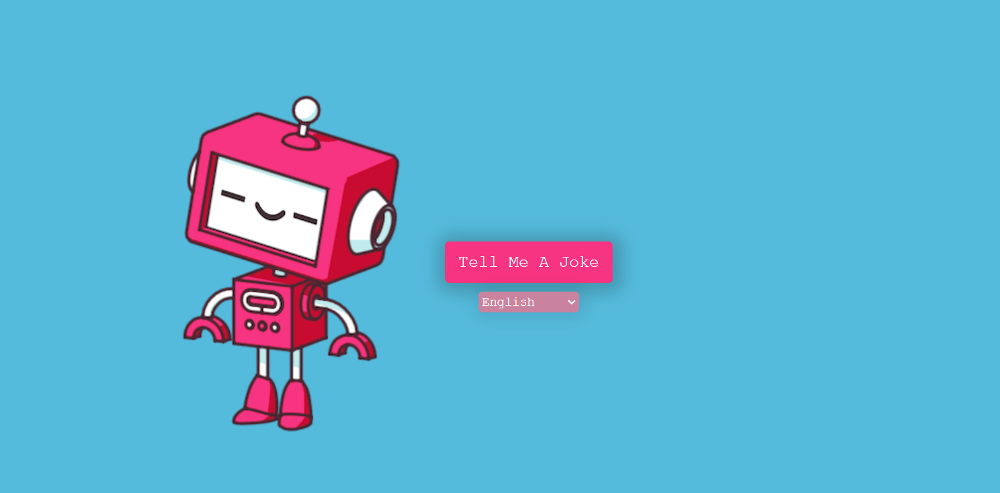

# joke-teller

Application that generates random jokes with this [JokeAPI](https://sv443.net/jokeapi/v2/).
Then with [Voice RSS API](https://www.voicerss.org/api/) allows conversion of textual content to speech.

Link: https://js-joketeller.netlify.app 

