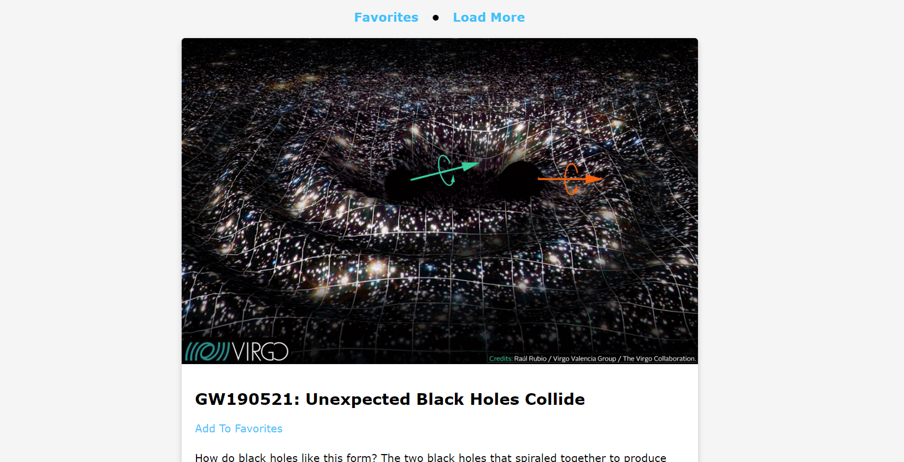

# nasa-articles

The application shows random astronomical images of the day with the [Nasa API](https://api.nasa.gov/).
The images are inserted in a card with their description.
Users can also bookmark some images, which are stored with the localStorage property.

Link: https://nasa-articles.netlify.app 

